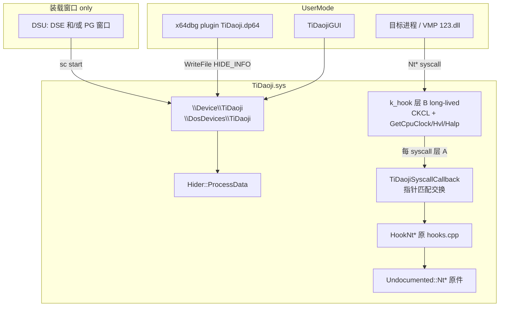
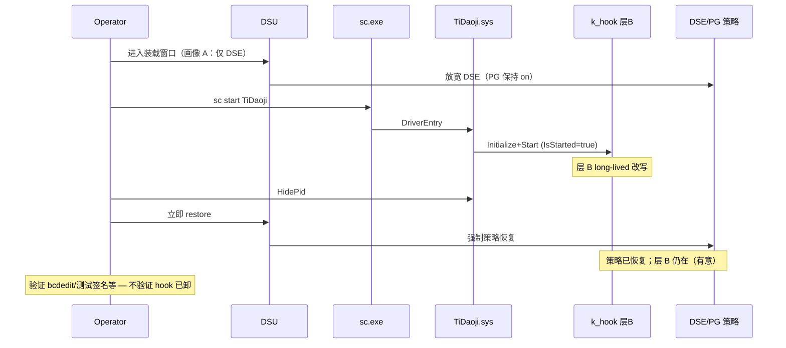
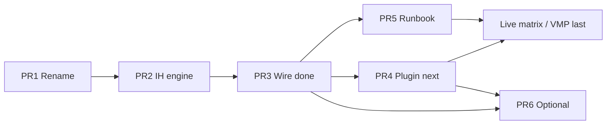

# TiDaoji 设计文档：TitanHide → InfinityHook 迁移 + 全量身份重命名

| 字段 | 值 |
|------|-----|
| **Document** | TiDaoji Design |
| **Author** | daoji / Grok Build |
| **Date** | 2026-08-06 |
| **Status** | Draft Rev 6 — PR1–PR3 已接线；残余风险缓解 + 族谱研究已落地 |
| **Base branch** | `pr3/wire-infinity-hook` @ `/Users/daoji/Code/TitanHide` |
| **Target product name** | **TiDaoji**（驱动 `TiDaoji.sys`） |
| **Repo** | **原地 hard-rename**：`/Users/daoji/Code/TitanHide` 内产品身份 hard-rename TitanHide→TiDaoji，保留同一 git 历史（K21） |
| **DSU profile** | **画像 A：仅临时 DSE**；全程 PG 开启；接受层 B 在 PG 下 long-lived 残余风险（K20） |
| **Implementation now** | PR3 InfinityHook 生产 hide；SSDT 写冻结；drain 5s |
| **Related research** | [`docs/2026-08-06-infinityhook-lineage-newos-research.md`](2026-08-06-infinityhook-lineage-newos-research.md)（IHPM/族谱/新系统；**不** vendor IHPM；**NOT PG-safe**） |

---

## Overview

现有 TiDaoji 通过 **SSDT 表项改写 + code cave 内联跳转**（`ssdt.cpp` / `hooklib.cpp`）长期挂住 `NtQueryInformationProcess` 等约 11 个 syscall。该路径直接修改内核关键结构，在启用 PatchGuard 的 Win10/11 上长时间运行会触发 `CRITICAL_STRUCTURE_CORRUPTION` (0x109)。目标环境（x64dbg 附着 + VT 辅助 + VMP 3.x / `123.dll` 反调试）需要 **可持续的内核 hide**，而不是“永久关 PG”。

**TiDaoji** 在保留 TitanHide hide 语义（含 `merge/lityrgia-vmp` 的 VMP 探针修复）的前提下做两件事：

1. **Hook 引擎替换**：废弃长期 SSDT/hooklib **写路径**，改为 **InfinityHook Pro 族**（ETW CKCL + GetCpuClock/Hvl/Halp 路径改写 + 每次 syscall 栈上函数指针交换）。**消除**经典 SSDT/code-cave 触发的 0x109 路径；**不声称** PG-safe，**不保证**任意 build 长期无蓝屏。
2. **可检测身份面全量重命名**：产物、服务、设备对象、符号链接、日志标签、插件默认设备名一律离开 `TitanHide`，统一为 `TiDaoji`，规避按 **已知 TitanHide 字符串** 的检测（不抗通用驱动枚举 / 行为指纹）。

### 诚实风险模型（钉死）

| 层 | 生命周期 | 说明 |
|----|----------|------|
| **A. per-syscall 栈交换** | 单次 syscall | 回调改 `*pCallAddress` → hook 函数；调用结束即回到正常路径 |
| **B. InfinityHook 基础设施改写** | **驱动存活全程 long-lived** | CKCL `EVENT_TRACE_FLAG_SYSTEMCALL`；`*GetCpuClock`；`HvlGetQpcBias`→`FakeHvlGetQpcBias`；可能改 `HvlpGetReferenceTimeUsingTscPage` / `HalpPerformanceCounterType` / `HalpOriginalPerformanceCounter`；`DetectThreadRoutine` 周期自愈 |
| **C. SSDT / ntos 代码页** | 不改 | 相对原 TiDaoji 的核心收益 |

**Restore 后 hide 仍依赖层 B 的 long-lived 内核改写仍在。这是有意取舍，不是“系统已干净”的副作用。**  
DSU restore 恢复的是 **DSE（及工具若提供的 PG 装载窗口）的强制策略**，**不是** 卸载 TiDaoji，也 **不是** 撤销 InfinityHook 改写。  
目标可证伪表述：

> **消除 SSDT/hooklib 写路径导致的经典 0x109。**  
> **不声称 PG-safe / 不保证任意 build、任意时长、与任意第三方内核模块并存时无蓝屏。**

加载策略：**DSU 类工具仅用于短暂放开装载窗口**，装载成功并 `Start()` 后 **立即 restore**。本设计 **不主张、不实现永久关闭 PatchGuard**。

---

## Background & Motivation

### 当前状态（可验证代码）

| 组件 | 路径 | 行为 |
|------|------|------|
| 驱动入口 | `TiDaoji/TiDaoji.cpp` | 从 `RegistryPath` 末段推导设备名，fallback `L"TiDaoji"`；创建 `\Device\<name>` + `\DosDevices\<name>`；`IRP_MJ_WRITE` → `Hider::ProcessData`；**忽略** `Hooks::Initialize()` 返回值（仅日志仍 `STATUS_SUCCESS`，`TiDaoji.cpp:175`） |
| Unload | `TiDaoji.cpp:14-19` | **先**删 symlink/device，**再** `Hooks::Deinitialize` — 顺序不佳 |
| Hook 安装 | `hooks.cpp` `Hooks::Initialize` | `SSDT::Hook` 挂 10–11 个 Nt*（`NtCreateThreadEx` 仅 `NtBuildNumber >= 6000`） |
| SSDT 写 | `ssdt.cpp` | x64：cave → `Hooklib::Hook` → 改 `pServiceTable[index]` |
| 内联 hook | `hooklib.cpp` | `RtlSuperCopyMemory` 改代码页 — **PG 敏感** |
| Hide 表 | `hider.cpp` | PID + `HIDE_TYPE`；HidePid 时 `KdDebuggerEnabled = 0` |
| 协议 | `TiDaoji.h` | `HIDE_INFO { Command, Type, Pid }`，含 `HideNtSystemVMInformation = BIT(11)` |
| 用户态 | GUI / x64dbg / Olly / TE | `CreateFileA("\\\\.\\TiDaoji")` + `WriteFile` |
| 插件 | `plugin.cpp` | `TiDaojiName`；`TiDaojiStop` **漏** unregister `TiDaojiName` |
| 池 tag | `_global.cpp` `GetPoolTag()` | 已是随机系统风格 tag，**无 Titan 指纹** |
| CR IH | `infinity_hook_pro/hook.cpp` | `IsStarted` **仅声明，从未 `= true`** → `Stop()` 体永不执行（阻断级上游 bug） |

VMP 相关已合入（`78e3283`）：

- `ProcessDebugObjectHandle` 长度/对齐/`STATUS_PORT_NOT_SET`
- `ObjectTypeInformation` 零长度探测
- `SystemFirmwareTableInformation` VM 字符串擦除（`HideNtSystemVMInformation`）
- 官方 DebugObject contribution 路径（#100/#101）
- HidePid 时 `KdDebuggerEnabled = 0`

### 痛点

1. **长期 SSDT 写 = PG 定时炸弹**。官方 README 要求关 PG；用户禁止永久关 PG。
2. **名称被指纹**。VMP 3.9.4+ 检测服务/设备名 `TiDaoji`；`.sys`、日志、`[TIDAOJI]` 均可被扫。
3. **“管道”误解**。控制面是 **`\Device` + `\DosDevices` + IRP_MJ_WRITE`**，**不是** Named Pipe。
4. **CR 已有 InfinityHook**（窗口保护）。**禁止**双 `Start()`。
5. **CR 源码 `Stop` 实际空操作**（`IsStarted` 未置位）— 移植时必须修，否则卸驱动易 BSOD。

### 目标工作流（产品层）

```
DSU 进入装载窗口 → sc create/start TiDaoji → InfinityHook Start（层 B 改写生效）
  → 插件 WriteFile HidePid
  → DSU 立即 restore（DSE/PG 强制策略恢复；层 B 仍存活 — 有意）
  → 调试会话靠层 A+B 继续 hide（接受 long-lived 改写残余风险）
  → 会话结束 Unhide → sc stop → Stop 完整恢复层 B → 卸驱动
```

**一句话钉死**：Restore 后 hide 依赖 **仍存活的 InfinityHook 基础设施改写**；这是有意取舍，不是无副作用，也不是“系统已回到干净受保护态且 hide 仍完全安全”。

---

## Goals & Non-Goals

### Goals

1. 产物与运行时身份全部为 **TiDaoji**（见身份矩阵），无编译出 `TitanHide.sys`。
2. Hook 引擎切换为 **InfinityHook Pro 族**，**不再**在生产 DriverEntry 路径调用 `SSDT::Hook` / `Hooklib::Hook`。
3. **完整保留** `hooks.cpp` hide 语义（含 lityrgia VMP + 官方 DebugObject）。
4. 控制协议 **二进制兼容** `HIDE_INFO`；默认设备名变更是 **有意不兼容默认路径**（用户态与驱动必须同发）。
5. 文档化 DSU 装载 → restore 序列、**画像 A（仅 DSE）**、假设与 **诚实** 残余 BSOD 风险。
6. x64dbg 默认 `\\.\TiDaoji`，保留 `TiDaojiName` 覆盖。
7. 与 CR InfinityHook **运行时硬失败互斥**（非仅文档）。
8. 移植时 **修复** CR `IsStarted`/`Stop` 状态机；Unload 可对称恢复层 B。
9. `Hooks::Initialize`：**全部**目标 Nt* 地址解析成功 + `Start` 成功才算成功；DriverEntry **检查返回值**，失败则清理并返回错误。

### Non-Goals

- 永久禁用 PatchGuard / DSE。
- 声称或证明 PG-safe / 任意时长零 0x109。
- 实现完整 Hypervisor / VT hide。
- 重写 hide 语义或改 `HIDE_INFO` 布局。
- x86 生产路径。
- 上游回馈官方 TiDaoji。
- 自动卸载 CR 驱动。
- 纯用户态 hide（如 ScyllaHide）作为主方案 — 见 Alternatives。

---

## Proposed Design

### 架构总览



### 身份重命名矩阵

| # | 表面 | 现状 | TiDaoji 目标 | 备注 |
|---|------|------|--------------|------|
| 1 | 驱动文件名 | `TitanHide.sys` | **`TiDaoji.sys`** | `TargetName` |
| 2 | 服务名 | `TitanHide` | **`TiDaoji`** | = RegistryPath 末段 → 设备名 |
| 3 | `\Device\` | `\Device\TitanHide` | **`\Device\TiDaoji`** | fallback `L"TiDaoji"` |
| 4 | `\DosDevices\` / `\\.\` | `TitanHide` | **`TiDaoji`** | **「管道」实为设备符号链接，非 Named Pipe** |
| 5 | 日志文件 | `C:\TitanHide.log` | **`C:\TiDaoji.log`** | 随 `DriverName` |
| 6 | 日志标签 | `[TIDAOJI]` | **`[TIDAOJI]`** | 全仓 |
| 7 | PDB | `TitanHide.pdb` | **`TiDaoji.pdb`** | |
| 8 | vcxproj/sln 工程名 | `TiDaoji*` | **`TiDaoji*`** | |
| 9 | 入口/头文件 | `TiDaoji.cpp/.h` | **`TiDaoji.cpp/.h`**（推荐） | include 同步 |
| 10 | 头守卫 | `_TIDAOJI_H` | **`_TIDAOJI_H`** | 与文件同步改 |
| 11 | x64dbg `PLUGIN_NAME` / 命令 | `TiDaoji`… | **`TiDaoji` / `TiDaojiUnhide` / `TiDaojiOptions` / `TiDaojiName`** | |
| 12 | 插件二进制 | `TiDaoji.dp64` 等 | **`TiDaoji.dp64` / `.dp32`** | 各配置 `TargetName` |
| 13 | 插件默认 `driverName` | `TiDaoji` | **`TiDaoji`** | BridgeSetting section `TiDaoji` |
| 14 | `CBSYSTEMBREAKPOINT` argv | `"TiDaoji"` | **`"TiDaoji"`** | `plugin.cpp:116` |
| 15 | `CBSTOPDEBUG` argv | `"TitanUnhide"` | **`"TiDaojiUnhide"`** | |
| 16 | `TiDaojiStop` unregister | 漏 `TiDaojiName` | **unregister 全部四命令** | 改名时一并修 |
| 17 | 内部符号 `TiDaojiInit`/`TiDaojiCall` | C 符号 | **推荐改为 `TiDaojiInit` 等** | **非远程检测面**；PR1 一并改以免混乱，可不进门禁例外 |
| 18 | GUI 默认/ini/caption | `TiDaoji` | **`TiDaoji`** | |
| 19 | Olly / TitanEngine | `\\\\.\\TiDaoji` | **`\\\\.\\TiDaoji`** | |
| 20 | **TiDaojiTest** | 注释/路径含 `TiDaoji` | **工程改名 + 设备串** | 勿漏 |
| 21 | install/README `sc create` | `TiDaoji` | **`TiDaoji`** | 新增 `install_driver.bat` |
| 22 | InfinityHook pool tag | CR `'VMON'` | **`'Tdji'`** | 驱动自有 `GetPoolTag()` 已是系统风格，**无需改** |
| 23 | `BreakOnSysRq.reg` | 调试辅助 | **N/A** | 与检测无关，可不改 |

**PR1 门禁**：`rg -i 'tidaoji|titan hide|TIDAOJI'` 在源码树清零（允许例外表：`LICENSE` 历史版权声明、`.git`、可选 `docs/history`）。

设备名派生逻辑保留（仅 fallback 变更）：服务名 = 设备名 = 符号链接名 = 默认 `\\.\` 名。

### InfinityHook 集成

#### 选型

| 选项 | 结论 |
|------|------|
| everdox 原版 | **否** — 1909+ 时钟路径失效 |
| FiYHer 上游 | 可用，但需再合 Win11 补丁 |
| **CR `infinity_hook_pro`** | **采用** — 本地已有；**但必须以源码为准审计，不假设 Stop 正确** |

#### 阻断级上游修复（K13 / PR2 硬要求）

CR `hook.cpp` 现状（已 `rg` 验证）：

```text
bool IsStarted = false;     // line 34 — 仅初始化
Start(): if (!IsStarted) { ... 安装 ... }  // 从不 IsStarted = true
         return true;                      // 甚至半失败也可能 true
Stop():  if (IsStarted) { ... 恢复 ... }   // 恒假 → 空操作
```

**移植规格（必须实现）**：

| 规则 | 要求 |
|------|------|
| `Initialize` | **只**解析 pattern / 保存 stock 快照 / 保存 callback；**不** Enable CKCL，**不**改时钟指针（相对 CR 的有意偏离，见生命周期） |
| `Start` 成功末尾 | 层 B 完整安装；`IsStarted = true` |
| `Start` 已启动且层 B 完整 | **真幂等**：`return true`，不重复安装 |
| `Start` 已启动但层 B 被剥 | **不**走空幂等；转 `Repair()`（策略 A，见下） |
| `Start` 失败 | 按「失败回滚序列」清掉本函数已做的 **全部** 副作用（含 CKCL）；`IsStarted` 保持 `false`；`return false`（**禁止**半改写后 `return true`） |
| `Repair()` | 仅 `IsStarted==true` 可调用；探针层 B；不完整则重装时钟/Hvl/Halp（**不**拆 DetectThread、**不**先 `IsStarted=false`） |
| `Stop` 入口 | `IsStarted==true`：全量恢复层 B + 停 DetectThread + 拆 CKCL SYSTEMCALL；末尾 `IsStarted=false` |
| `Cleanup()` | **不依赖 `IsStarted`**：若 Running → 等价 `Stop`；若仅 Ready/Start 失败残留 → 拆 CKCL + 回滚任何已写时钟指针 |
| `Stop`/`Cleanup` 干净态 | 幂等 `return true` |
| 回归 | `Start→Stop→Start`；`sc stop` 无挂起时钟；**Start 失败后 CKCL 无 SYSTEMCALL 残留**；U4 模拟拨回时钟后 Repair |

**不要**假设「CR 生产在用」= Stop 正确。CR `Main.cpp` 虽 `Stop()` + 10s delay，但在此 bug 下 Stop 体不跑。

#### 策略 A（写死）：`Start` 幂等 vs DetectThread 自愈

CR `DetectThreadRoutine`（`hook.cpp:187-211`，**仅 build≤18363**）在 `*GetCpuClock != SelfGetCpuClock` 时再调 `Initialize+Start`，依赖 **`IsStarted` 永假** 才能重进安装分支。修好状态机后若「已启动则空返回」，自愈死亡。

**TiDaoji 选定策略 A（拒绝 B/C 作为默认）**：

| 选项 | 含义 | 结论 |
|------|------|------|
| **A** | 保留 DetectThread；`Start` 真幂等仅当层 B 完整；否则 `Repair()` 强制重装 | **采用** |
| B | 删/默认关 DetectThread，无运行时自愈 | 不采用（≤18363 上 hide 可被静默剥掉） |
| C | 自愈前 `IsStarted=false` 再 `Start` | 不采用（与 `Stop`/Unload 并发易打成竞态） |

**策略 A 行为表**：

```text
Start():
  if (!m_Ready) return false;                 // 必须先 Initialize
  if (IsStarted) {
    if (LayerBIntact()) return true;          // 真幂等
    return Repair();                          // 层 B 被剥 → 重装，保持 IsStarted
  }
  // 冷启动安装：ConflictProbe → EnableCkcl → InstallClocks → EnsureDetectThread
  // 任一步失败 → RollbackStartPartial() → return false（IsStarted 仍 false）

Repair():                                     // DetectThread 只调这个，禁止再调冷 Start 安装路径
  if (!IsStarted) return false;
  if (LayerBIntact()) return true;
  // 不停止 DetectThread、不改 IsStarted
  // ≤18363: 写回 *GetCpuClock = SelfGetCpuClock（若指针槽仍有效）
  // >18363: 按与冷 Start 相同顺序重写 GetCpuClock=2 / Hvl / Halp（先确认 stock 快照仍在）
  // 失败：打 [TIDAOJI] repair failed，保持 IsStarted（仍尝试下周期）；不调用 Stop

DetectThreadRoutine:
  while (m_DetectThreadStatus) {
    Sleep(1000);
    if (!IsStarted) continue;
    if (!LayerBIntact()) Repair();            // 扩展：>18363 也做探针（CR 原版只修 ≤18363）
  }

LayerBIntact() 定义见下节「冲突与完整探针」
```

**并发规则**：`Repair` / `Stop` / 冷 `Start` 共用一把自旋锁或快速互斥（`KGUARDED_MUTEX` / 自旋在 PASSIVE）；`Stop` 先 `m_DetectThreadStatus=false` 并 `KeWaitForSingleObject` DetectThread，再恢复指针——**Repair 不得在 Stop 已清 `IsStarted` 后继续写**。

#### 生命周期与 Start 失败清理（Issue 15）

相对 CR：`Initialize` 内 `EventTraceControl` 开 SYSTEMCALL（`hook.cpp:229-243`）导致 **ETW 副作用早于 `IsStarted`**。TiDaoji **把 CKCL Enable 挪进 `Start`**。

```text
状态：
  Idle     — 无 pattern、无 CKCL、无时钟改写
  Ready    — Initialize 成功：pattern/stock 快照/callback 已保存；无内核变异
  Running  — Start 成功：CKCL SYSTEMCALL + 时钟/Hvl/Halp + DetectThread；IsStarted=true

Idle  --Initialize--> Ready
Ready --Start OK----> Running
Ready --Start FAIL--> Idle     （RollbackStartPartial 后必须回 Idle，不留 CKCL）
Running --Stop------> Idle
任意 --Cleanup------> Idle     （不依赖 IsStarted）
```

**`Initialize` 成功后 `Start` 失败 — 精确回滚序列**（实现必须按序，可中断点标注日志阶段）：

```text
RollbackStartPartial():          // Start 内部失败或 Hooks 在 Start==false 后调用 Cleanup
  1. 若已创建/引用 DetectThread 且本轮新建：
       m_DetectThreadStatus = false;
       KeWaitForSingleObject(DetectThread);
       ObfDereferenceObject; m_DetectThreadObject = NULL;
       // 注意：冷 Start 失败时通常尚未 IsStarted，线程若已建必须收尸
  2. 若已改 HvlGetQpcBias：*m_HvlGetQpcBias = m_StockHvlGetQpcBias
  3. 若已改 HvlpGetReferenceTimeUsingTscPage：恢复 m_StockHvlpGetReferenceTime...
  4. 若已改 HalpPerformanceCounterType / HalpOriginalPerformanceCounter：恢复 stock
  5. 若已改 *m_GetCpuClock：*m_GetCpuClock = m_StockGetCpuClock
  6. 若已 Enable CKCL SYSTEMCALL：
       EventTraceControl(EtwpUpdateTrace) 去掉 SYSTEMCALL
       或 StopTrace+StartTrace 回到无 SYSTEMCALL 基线（与 CR Stop 同类）
  7. ckcl_enabled = false; IsStarted = false;  // 保持 m_Ready 或降为 Idle：
       TiDaoji 选择：Start 失败后 m_Ready = false（回 Idle），
       强制下次全量 Initialize，避免脏 pattern 指针
  8. 日志 [TIDAOJI] Start rollback done phase=<最后成功步>
```

**`Hooks::Initialize` 伪代码（更正：禁止对 Start 失败只调 `Stop()`）**：

```cpp
int Hooks::Initialize()
{
    const int expected = ((NtBuildNumber & 0xFFFF) >= 6000) ? 11 : 10;
    if (!ResolveAllOrigPointers())
        return 0;
    if (!k_hook::Initialize(TiDaojiSyscallCallback)) // Ready only，无 CKCL
        return 0;
    if (!k_hook::Start()) {
        k_hook::Cleanup();   // 非 Stop()：IsStarted 可能仍 false，必须能拆 CKCL/半装时钟
        return 0;
    }
    return expected;
}

void Hooks::Deinitialize()
{
    k_hook::Cleanup();       // Running→Idle；幂等
}
```

**DriverEntry 失败路径**：`Hooks::Initialize==0` 后仍 `Cleanup()` 一次（幂等）再删设备——保证 **加载失败后 CKCL 不得残留 SYSTEMCALL**（验收：失败 sc start 后二次加载不因脏 CKCL 误判；或 ETW 会话标志检查）。

#### 冲突与完整探针（Issue 16 — 可测试算法）

**禁止**仅以 `GetCpuClock == 2` 判定冲突（现代路径 stock 常为索引 `2`，CR 自己也写 `2`）。

`Initialize` 在 Ready 时保存 stock 快照（只读，无改写）：

```text
m_StockGetCpuClock              = *m_GetCpuClock
m_StockHvlGetQpcBias            = *(fn*)m_HvlGetQpcBias          // build>18363 且已解析
m_StockHvlpGetReferenceTime...  = *m_HvlpGetReferenceTimeUsingTscPage
m_StockHalpPerformanceCounterType = *m_HalpPerformanceCounterType
```

**`ConflictProbe()`（冷 `Start` 改写前，零副作用）**：

```text
// 共同：若已是我们自己的 hook，不算外部冲突（应走 Repair 而非 fail）
if (build <= 18363) {
  cur = *m_GetCpuClock
  if (cur == SelfGetCpuClock) return NoConflict   // 自身
  // stock 应为 ntos/hal 内可执行指针（或已知合法时钟例程）
  if (cur != m_StockGetCpuClock) {
    if (!PointerInModule(cur, ntoskrnl) && !PointerInModule(cur, hal))
      return Conflict   // 外来函数钩子（典型另一 IH）
    // 若在 ntos 内但与 stock 不同：可能是热补丁/合法切换 → 更新 stock 并 NoConflict
    //   或保守：Conflict（TiDaoji 选保守：视为 Conflict 仅当不可识别）
    // 明确：与 m_Stock 相同 → NoConflict
  }
  return NoConflict
} else {
  // 现代路径：禁止 if (GetCpuClock==2) return Conflict
  if (m_HvlGetQpcBias) {
    curHvl = *m_HvlGetQpcBias
    if (curHvl == FakeHvlGetQpcBias) return NoConflict  // 自身已装，应 Repair
    if (curHvl != m_StockHvlGetQpcBias)
      return Conflict   // 他人已换 HvlGetQpcBias（CR/其它 IH）
  }
  // 可选加强：Halp type 已是 VM 型且 Hvl 异常时 Conflict
  // GetCpuClock 值本身（0/1/2/3）不单独作为冲突条件
  return NoConflict
}
```

**`LayerBIntact()`（Repair / 幂等）**：

```text
if (build <= 18363)
  return (*m_GetCpuClock == SelfGetCpuClock)
else
  return (*m_GetCpuClock == (void*)2)
      && (*m_HvlGetQpcBias == FakeHvlGetQpcBias)
      // 若冷 Start 改过 Halp type，则 type 仍为安装时目标值
```

**U3 收紧**：

| ID | 场景 | 期望 |
|----|------|------|
| U3a | 干净机（无 CR）冷 Start | **必须成功**（GetCpuClock 已为 2 不得误杀） |
| U3b | 先开 CR 再开 TiDaoji | Conflict 日志 + 加载失败 |
| U3c | 人工把 Hvl 换成非 stock 非 Fake | Conflict |
| U4 | Running 中拨回 GetCpuClock/Hvl 后 ≤2s | Repair 恢复或日志 repair failed；不 BSOD |

#### 仓库布局

```
TiDaoji/
  TiDaoji.sln
  TiDaoji/
    TiDaoji.cpp / TiDaoji.h
    hooks.cpp / hooks.h
    hider.* / undocumented.* / ntdll.* / pe.* / log.* / ...
    ssdt.cpp          # 仅保留只读 GetFunctionAddress
    legacy/           # 可选：原 SSDT::Hook + hooklib，默认不链接
    infinity_hook/    # 自 CR 移植 + IsStarted 修复
      hook.h / hook.cpp / headers.h / defines.h / utils.hpp / hde/
  TiDaoji_x64dbg/     # TargetName → TiDaoji.dp64
  TiDaojiGUI/
  TiDaojiTest/
  install_driver.bat / uninstall_driver.bat
  README.md           # PR3 前顶栏 NOT PG-SAFE 警告见 PR Plan
```

#### Hook 安装：指针交换 + 严格成功准则

**硬性不变量**：

1. 匹配用的原地址 **仅** 来自 `SSDT::GetFunctionAddress("Nt...")`，**禁止**用 `MmGetSystemRoutineAddress` 结果做 `*pCallAddress ==` 比较（`undocumented.cpp` 中 NtClose 等导出路径与 SSDT 槽指向可能不一致）。
2. 回调 **不得** 照抄 `protect_window` 的 `ssdt_index >> 12 <= 0`（那是 Shadow SSDT / win32k 过滤）。
3. InfinityHook `SelfGetCpuClock` 对 `ExGetPreviousMode() == KernelMode` 直接 `__rdtsc()` **不进回调** → **KernelMode 调用路径不拦截**。现有 hook 体多数已对 KM 旁路；语义差：**TiDaoji 不保证对 KM 发起的 Nt* 做 hide**。日后若加 KM hide，不能依赖本引擎。
4. Nt* 解析：**应解析数量** 全部非空 + `k_hook::Initialize`（→Ready）+ `k_hook::Start`（→Running）全成功才返回成功；`Start` 失败 → **`Cleanup()`**（非 `Stop()`）→ 返回 0。

**应解析数量**：`NtBuildNumber >= 6000` → **11**；否则 **10**。

##### API → g_Orig → Hook → HIDE_TYPE 对照表（PR3）

| # | API 名 | g_Orig | Hook 函数 | 主要 HIDE_TYPE / 语义 |
|---|--------|--------|-----------|------------------------|
| 1 | `NtQueryInformationProcess` | `g_NtQIP` | `HookNtQueryInformationProcess` | DebugFlags / Port / ObjectHandle |
| 2 | `NtQueryInformationThread` | `g_NtQIT` | `HookNtQueryInformationThread` | ThreadHideFromDebugger / Wow64 Context |
| 3 | `NtQueryObject` | `g_NtQO` | `HookNtQueryObject` | DebugObject |
| 4 | `NtQuerySystemInformation` | `g_NtQSI` | `HookNtQuerySystemInformation` | SystemDebugger + Firmware VM |
| 5 | `NtSetInformationThread` | `g_NtSIT` | `HookNtSetInformationThread` | HideThreadHideFromDebugger |
| 6 | `NtClose` | `g_NtClose` | `HookNtClose` | 非法 handle |
| 7 | `NtDuplicateObject` | `g_NtDup` | `HookNtDuplicateObject` | 配合 Close |
| 8 | `NtGetContextThread` | `g_NtGCT` | `HookNtGetContextThread` | DRx |
| 9 | `NtSetContextThread` | `g_NtSCT` | `HookNtSetContextThread` | DRx |
| 10 | `NtSystemDebugControl` | `g_NtSDBC` | `HookNtSystemDebugControl` | SysDbg |
| 11 | `NtCreateThreadEx` | `g_NtCTX` | `HookNtCreateThreadEx` | 剥 HIDE_FROM_DEBUGGER（≥6000） |

回调：指针相等匹配；禁止 `ssdt_index >> 12` 过滤。原件：`Undocumented::Nt*`（**匹配**仅 SSDT 槽地址）。

#### DriverEntry / Unload 契约

**DriverEntry**：派生名 → NTDLL/Undocumented/CrossThreadFlags → Device → Symlink（失败删 Device）→ `Hooks::Initialize`；若 0：`Cleanup` + 删 symlink/device + NTDLL 清理 → `STATUS_UNSUCCESSFUL`。  
**Unload**：`Cleanup`/`Stop` → drain 默认 **5s**（`TIDAOJI_UNLOAD_DRAIN_MS`；研究可 10s）→ 删设备 → NTDLL。  
**加载失败后**：CKCL 不得残留 SYSTEMCALL（`Cleanup` 契约）。

#### 与 CR InfinityHook 互斥（PR3）

| 规则 | 实现 |
|------|------|
| README 红字 | 先停 CR |
| 冷 Start 前 | `ConflictProbe()`（**禁止**单靠 `GetCpuClock==2`） |
| 日志 | `[TIDAOJI] conflict: another InfinityHook owner? GetCpuClock=%p Hvl=%p` |
| 返回 | `Hooks::Initialize`→0 |
| DetectThread | 只 `Repair()`，不与外部 IH「互抢重 Initialize」；外部已占则冷 Start 已失败 |

双 IH 仍是默认威胁：靠 **ConflictProbe 硬失败**，不靠 DetectThread 抢回。

### 装载路径与 DSU

#### 术语

- **DSU**：临时打开 **DSE** 装载窗口的工具类（本机候选：`DisabledDSE.exe`、DHS 等；具体二进制可在 PR5 填命令，**画像已钉死为 A**）。
- **Restore**：恢复 **DSE / 测试签名** 强制策略（画像 A **不**依赖关 PG）。**验证对象是 DSE/签名策略状态，不是“hook 已卸”或“内核已干净”。**

#### 装载画像（已决议）

| 画像 | DSU 能力 | 装载瞬间 | Start 之后 / restore 之后 | 决议 |
|------|----------|----------|---------------------------|------|
| **(A) 仅 DSE 窗口** | 只放行未签名装载 | **PG 全程开启** | 层 B 在 PG 开启下完成并长期存在；**接受该残余风险** | **采用（K20）** |
| **(B) DSE+PG 窗口** | 装载期同时抑制 PG | 装载与 Start 在 PG 窗口内 | restore 后 PG 再开，层 B 仍在 | **不采用** |

PR5 Runbook **只写画像 A**：进入 DSE 窗口 → 装载 → Hide → **立即 restore DSE**；明确 PG 从未因本流程关闭。工具命令模板仍可占位，但不得暗示画像 B。

#### 序列



#### 残余 BSOD / 不稳定风险

| 严重度 | 风险 | 缓解 | PR3+ 落地 |
|--------|------|------|-----------|
| **高** | **层 B long-lived**（GetCpuClock/Hvl/Halp/CKCL）与未来 PG 规则、HVCI、完整性策略交互 → 可能 0x109 或其它 bugcheck | 不声称 PG-safe；支持矩阵实测；缩短不必要存活时间 | **接受（K20）**；README 顶栏 |
| **高** | InfinityHook pattern/栈 magic（`0x501802`/`0x601802`/`0xF33`、`pStackCurrent[9]`）失效 → 崩溃或静默不 hook | 严格失败；分阶段日志 | `Start: FAIL reason=…`；装载硬失败 |
| **高** | `Stop`/`IsStarted` 未修导致卸驱动后时钟指已卸模块 | **PR2 阻断修复** + 回归 | PR2 已合 |
| **高** | 与 CR 双 IH | Start 前硬失败 | `reason=ConflictProbe`；无抢回 |
| **中** | Unload 与 inflight syscall 竞态 | Stop 内等线程 + unload drain delay | drain 默认 **5s**（`TIDAOJI_UNLOAD_DRAIN_MS`；研究可 10s） |
| **中** | DSU restore 失败但操作者以为已恢复 | Runbook 验证清单 | PR5 范围 |
| **中** | 实现回归再次 SSDT 写 | 静态禁止生产调用 `SSDT::Hook` | **写路径默认冻结**（`#ifndef TIDAOJI_ALLOW_SSDT_FALLBACK`） |
| **低** | `KdDebuggerEnabled` 全局副作用 | 文档 | 未改 |
| **低** | `C:\TiDaoji.log` / 固定服务名 / 模块列表 `TiDaoji.sys` 被扫 | Security 节承认 | 未改 |

**验证窗口**：无 0x109 **≥ 2h** 多 build 为 **冒烟+耐久**；**不是** PG 形式化证明。30min 仅作早期冒烟，不得写入“PG 已验证”结论。

---

## Implementation Contracts

### `k_hook`（移植后 — Idle / Ready / Running）

```text
bool Initialize(InfinityCallbackPtr cb);
  成功 → Ready：pattern + stock 快照 + cb；IsStarted=false；**无 CKCL Enable、无时钟写**
  失败 → Idle：false；不得留下 SYSTEMCALL 跟踪（本阶段本就不 Enable）

bool Start();
  前置: Ready（或 Running 见下）
  若 Running && LayerBIntact → true（真幂等）
  若 Running && !LayerBIntact → Repair()
  若 Ready: ConflictProbe → EnableCkcl → InstallClocks → EnsureDetectThread
     成功 → Running，IsStarted=true
     失败 → RollbackStartPartial() → Idle，IsStarted=false，return false
  日志阶段标签: Conflict / CKCL / Clocks / DetectThread / Repair

bool Repair();
  前置: Running；层 B 不完整时重装；不拆 DetectThread；不清除 IsStarted
  DetectThread 周期只调 Repair，不调冷 Start

bool Stop();
  前置: Running（否则 true 幂等）
  停 DetectThread 并等待 → 恢复时钟/Hvl/Halp → 拆 CKCL SYSTEMCALL
  → Idle，IsStarted=false

bool Cleanup();
  // 不依赖 IsStarted — Start 失败后必须用这个，不能只用 Stop
  if (IsStarted) return Stop();
  else { RollbackStartPartial 中与「半装」相关的步骤（CKCL/时钟/孤儿线程）；→ Idle }
  幂等
```

### `Hooks`

```text
int Initialize();
  >0 : == expected (10|11)，引擎 Running
  0  : 解析不全 | Conflict | Start 失败（已 Cleanup）

void Deinitialize();
  Cleanup() 幂等
```

### 冲突

```text
算法: ConflictProbe() — 见「冲突与完整探针」；禁止 GetCpuClock==2 单独判冲突
检测点: 冷 Start 首次改写前
失败: Hooks::Initialize → 0
日志: [TIDAOJI] conflict: another InfinityHook owner? GetCpuClock=%p Hvl=%p
```

### 日志最小集合（PR3 DoD）

| 事件 | 必打 |
|------|------|
| Driver Init | NTDLL / Undocumented / Device / Symlink |
| Hook 解析 | 地址或首个失败名 |
| IH Initialize | pattern 阶段 / stock 快照 / Ready |
| Start | OK+build+count **或** FAIL+阶段 |
| Start rollback | `Start rollback done phase=` |
| Conflict | 固定文案 + 两指针 |
| Repair | ok / failed |
| HidePid/Unhide | pid + type |
| Stop/Cleanup | OK/FAIL |
| Unload | drain 完成 |

### VMP / 引擎回归（PR3）

| ID | 检查项 | 期望 |
|----|--------|------|
| V1–V15 | 同 Rev2 hide 语义表 | 原语义 |
| U1 | Start→Stop→Start | 无 BSOD；第二次 Start 真幂等或冷装成功 |
| U2 | sc stop | 无挂起时钟；Stop/Cleanup 完整 |
| U2b | **故意 Start 失败**（模拟 Conflict）后 | CKCL **无** SYSTEMCALL 残留；可再次 Initialize+Start |
| U3a | 干净机冷 Start（GetCpuClock 可能已是 2） | **成功** |
| U3b | 先 CR 再 TiDaoji | 失败 + conflict |
| U3c | 人工改 Hvl≠stock | conflict |
| U4 | Running 中拨回时钟后 | Repair 恢复或 repair failed 日志；不空幂等丢 hook |

---

## API / Interface Changes

| 接口 | 变更 |
|------|------|
| `HIDE_INFO` 布局 | 无 |
| 默认设备路径 | `\\.\TiDaoji` → `\\.\TiDaoji`（**默认路径有意不兼容**） |
| `Hooks::Initialize` | 返回值现网被忽略 → **必须检查**；0=失败 |
| 插件命令 | `TiDaoji` / `TiDaojiUnhide` / `TiDaojiOptions` / `TiDaojiName` |

用户态与驱动 **PR1 同发**，禁止只发驱动不改插件默认名。

---

## Data Model Changes

无持久 schema。HideEntries 内存数组不变。日志路径 `C:\TiDaoji.log`。

---

## Alternatives Considered

### 1. 永久关 PG + 保留 SSDT

拒绝 — 违反硬约束。

### 2. everdox 原版 InfinityHook

拒绝 — 现代 Windows 不可用。

### 3. ObRegisterCallbacks 替代 Nt* hook

拒绝 — 覆盖面不足（SystemInformation/Context/Close 等）。

### 4. 自研 hypervisor EPT hook

本期 Non-Goal。

### 5. 采用 CR infinity_hook_pro + 修复状态机（选定）

采用；**强制修 IsStarted/Stop**。

### 6. 纯用户态 hide（ScyllaHide 等）

- **优点**：无内核/PG 问题；官方 TiDaoji README 亦指向其作为替代。
- **缺点**：无法覆盖本目标依赖的 **内核路径 Nt\*** 与 VMP 内核探针（DebugObject 计数、部分 SystemInformation、与真实 SSDT 语义一致的返回值）。
- **结论**：可作为辅助，**不能**替代 TiDaoji 内核 hide。列入 Non-Goal 主路径。

---

## Security & Privacy Considerations

| 主题 | 说明 |
|------|------|
| 威胁模型 | 本地 VMP/反调试字符串与简单驱动名指纹；非远程 |
| 权限 | 内核 = 最高；仅测试机 |
| rename 边界 | **只抗已知 TiDaoji 字符串**；**不抗** 通用 `\Driver` 枚举、`TiDaoji.sys` 模块列表、固定服务名二次指纹、CKCL/时钟行为异常 |
| 检测面残留 | 固定服务名 `TiDaoji`；`C:\TiDaoji.log`；InfinityHook 行为；加载模块名 |
| 供应链 | NOTICE + 固定移植来源 commit |

---

## Observability

见 **Implementation Contracts → 日志最小集合**。无正式 metrics。  
告警：人工 DebugView 过滤 `TIDAOJI`；0x109 即失败。  
失败可观测硬指标（PR3）：

- `Start` 失败阶段枚举：`CKCL` / `EtwpDebuggerData` / `GetCpuClock` / `Hvl` / `Halp` / `Conflict` / `Resolve`
- `Stop` OK/FAIL
- `hook_resolved=N expected=M`

---

## 兼容性（Windows 版本）

矩阵标注为 **CR 源码声称 / 待 TiDaoji 验证**，非本项目实测：

| 平台 | CR 声称 | TiDaoji 状态 |
|------|---------|--------------|
| Win10 ≤18363 | GetCpuClock 函数替换 | **待验证** |
| Win10 20H1–22H2 | GetCpuClock=2 + Hvl 路径 | **待验证** |
| Win11 22000–22631 | 同上 + Halp pattern | **待验证** |
| Win11 23606+ | magic `0x601802` 等 | **待验证 / 尽力** |
| 更新预览 | — | **可能失败** |

**脆弱点（与 pattern 同级）**：栈 magic `0x501802`/`0x601802`/`0xF33`；`pStackCurrent[9]` 偏移；`GetSyscallEntry`（LSTAR/KVASCODE）。任一失效可致不 hook 或崩溃。

**PR3 最低验证 build 集合**（可调整，须在 PR 描述写死实测列表）：

1. 一版 Win10 22H2 x64  
2. 一版 Win11 22H2 或 24H2 x64  

`Start()` 失败 → 整驱动失败，**无** SSDT 静默回退。

可选编译开关 `TIDAOJI_ALLOW_SSDT_FALLBACK` 默认 **关闭**，仅隔离实验。

---

## Rollout Plan

1. 仓库：`/Users/daoji/Code/TitanHide` **原地 hard-rename**（K21）；分支自 `merge/lityrgia-vmp` 拉 `feature/tidaoji-infinityhook`（或等价）。
2. **当前实施范围：仅 PR1 rename**；PR2 及以后未开工。
3. 按 PR Plan 增量；**PR1/PR2 README 顶栏标注 `NOT PG-SAFE / still SSDT or engine-not-wired`**，直至 PR3 合并。
4. 验证（PR3+）：**画像 A**（仅 DSE，PG 全程 on）装载 → hide → restore DSE → **≥2h** 耐久 + U1/U2/U3 + V1–V15 子集。
5. 回滚：`sc stop/delete TiDaoji`；git 历史可回退 rename 提交。
6. Feature flag：仅 `TIDAOJI_ALLOW_SSDT_FALLBACK`（默认关）。

---

## Key Decisions

| # | 决策 | 理由 |
|---|------|------|
| K1 | 身份面统一 **TiDaoji** | 抗已知 TiDaoji 指纹；单一真相源 |
| K2 | 引擎 = CR `infinity_hook_pro` 移植 | 现代时钟路径；本地锚点 |
| K3 | 生产禁止 SSDT 写自动回退 | 避免 restore 后假安全 |
| K4 | 保留 `SSDT::GetFunctionAddress` + `Undocumented::*` | 最小改动保留 hide 语义 |
| K5 | 回调 **指针相等** 匹配 | 抗 syscall 号变化；对齐 CR |
| K6 | `HIDE_INFO` 布局不变 | 协议稳定 |
| K7 | DSU 仅装载窗 + 立即 restore；**层 B 有意存活** | 用户硬约束；诚实取舍 |
| K8 | 与 CR 双 IH：**Start 前硬失败** | 共享 CKCL/时钟；DetectThread 互抢 |
| K9 | 「管道」= 设备 I/O | 避免 pipe 误实现 |
| K10 | 产品身份切断 TiDaoji 名称（硬分叉语义） | 检测规避；实现上见 K21 原地 rename |
| K11 | 保留 lityrgia VMP 语义 | 目标依赖 |
| K12 | x64 唯一生产架构 | IH 实现中心 |
| **K13** | **移植必须修复 `IsStarted`/`Stop` 状态机** | 上游 Stop 空操作；否则不可卸 |
| **K14** | **全部 Nt* 解析 + Start 成功才加载成功**；部分成功 = 失败 | 禁半残驱动；DriverEntry 必须检查返回值 |
| K15 | 匹配地址仅 `SSDT::GetFunctionAddress` | 与栈上 SSDT 指针一致 |
| K16 | KM 路径不拦截（IH 限制） | 写明语义差，避免误用 |
| **K17** | **策略 A**：`Start` 真幂等当且仅当 `LayerBIntact`；否则 `Repair()`；DetectThread 只调 `Repair` | 修 IsStarted 后避免自愈死亡，且避免 C 类竞态 |
| **K18** | **CKCL Enable 仅在 `Start`**；`Initialize` 无内核变异；失败用 `Cleanup`/`RollbackStartPartial` 非裸 `Stop` | 消除 Ready+Start 失败时 ETW 残留 |
| **K19** | **ConflictProbe 禁止单靠 `GetCpuClock==2`**；以 Hvl/stock 快照与外来指针为准 | 避免现代 build 干净机误杀 |
| **K20** | **DSU 画像 A：仅临时 DSE；PG 全程开启**；接受 InfinityHook 层 B 在 PG 下 long-lived 风险 | 用户 2026-08-06 拍板；不走画像 B |
| **K21** | **原地 hard-rename**：在 `/Users/daoji/Code/TitanHide` 内 TitanHide→TiDaoji，**同一 git 历史**；不新建平行仓库 | 用户 2026-08-06 拍板 |
| **K22** | **实施顺序：先 PR1 rename only**；PR2 InfinityHook 另开 | 用户 2026-08-06 拍板 |

---

## Open Questions

1. ~~**DSU 确切工具与画像**~~ → **Resolved（K20）**：画像 **A（仅临时 DSE）**；PG 全程 on；接受层 B 在 PG 下残余风险。具体 DSU 二进制/命令行可在 PR5 补全，**不**再选 B。  
2. ~~**仓库形态**~~ → **Resolved（K21）**：**原地 hard-rename** `/Users/daoji/Code/TitanHide`，保留同一 git 历史。  
3. ~~**Olly / TitanEngine**~~ → **Resolved（Rev 9）**：身份已改名；PR4 深度打磨（ini + `user_client.h` + 错误路径）；仍非 VMP 矩阵门禁  
4. **日志路径**：仍 `C:\TiDaoji.log` 还是默认关文件日志？  
5. ~~运行时互斥~~ → **已关闭**：PR3 硬失败。  
6. **服务名随机化**：本期固定 `TiDaoji`；是否后续安装脚本随机名？  
7. **驱动签名长期方案**。  
8. **Win11 Canary** 是否纳入支持矩阵。

---

## References

- TiDaoji：`/Users/daoji/Code/TitanHide` @ `78e3283`  
- `TiDaoji.cpp` DriverEntry/Unload；`hooks.cpp` Initialize；`ssdt.cpp`/`hooklib.cpp`  
- `hider.cpp` KdDebuggerEnabled；`TiDaoji.h` HIDE_*  
- `plugin.cpp` 命令与 Stop 漏 unregister  
- `_global.cpp` `GetPoolTag` 无 Titan 指纹  
- CR：`infinity_hook_pro/hook.cpp`（`IsStarted` bug）；`protect_window.cpp` 回调；`Main.cpp` unload 10s delay  
- everdox/InfinityHook；FiYHer/InfinityHookPro  
- `/Users/daoji/Reverse/DisabledDSE.exe` 等 DSU 候选  

---

## PR Plan

### PR1 — 身份重命名（行为仍为 SSDT）— **当前实施目标**

- **Title**：`rename: TiDaoji identity surfaces → TiDaoji`
- **Scope now**：**仅本 PR**（K22）；不引入 infinity_hook、不改 hook 引擎。
- **Repo**：在 `/Users/daoji/Code/TitanHide` **原地**改名（K21），同一 git 历史。
- **Files**：驱动/插件/GUI/Test/Olly/TE 名称与字符串；vcxproj `TargetName`（含 `.dp64`）；头守卫；`CBSYSTEMBREAKPOINT` 命令串；`TiDaojiStop` 全命令 unregister；`install_driver.bat`；fallback `L"TiDaoji"`；可选目录/工程 `TiDaoji*`→`TiDaoji*`
- **Dependencies**：无
- **Description**：纯身份。`rg` 门禁清零。仍 SSDT。  
- **风险顶栏（README）**：`⚠️ NOT PG-SAFE — still SSDT/hooklib; do NOT use final DSU-restore long-run workflow on this build. DSU profile A = DSE-only; PG remains on.`  
- **同发**：用户态默认设备名与驱动服务名必须同一 PR。

### PR2 — 引入 infinity_hook + 状态机 + 策略 A + Cleanup

- **Title**：`feat: vendor infinity_hook_pro with IsStarted/Repair/Cleanup lifecycle`
- **Files**：`TiDaoji/infinity_hook/**`；NOTICE；vcxproj；tag `'Tdji'`
- **Dependencies**：PR1
- **Description**：  
  - 移植 CR；**修 IsStarted**  
  - **K17**：`Repair` + DetectThread 只 Repair；`Start` 真幂等条件 = `LayerBIntact`  
  - **K18**：CKCL 移入 `Start`；`Cleanup`/`RollbackStartPartial` 完整序列  
  - **K19**：`ConflictProbe` 算法 + stock 快照  
  - 自测：U1、U2b（Start 失败无 CKCL 残留）、U3a（干净机）  
  - **仍不**接线 `Hooks` 生产 hide  
- **README 顶栏**：`engine present but not wired; still SSDT for hide`

### PR3 — Hooks 切换 InfinityHook + 契约落地 — **代码已合入**

- **Title**：`feat: wire Hooks to InfinityHook; strict resolve; conflict fail; unload order`
- **Status**：**done** on `pr3/wire-infinity-hook`（接线 + 残余缓解 + 研究文档）；**不**以 live 矩阵为 PR3 关门条件
- **Files**：`hooks.cpp/h`；`TiDaoji.cpp` Entry/Unload；`ssdt` 隔离写路径；hooklib 写路径冻结
- **Dependencies**：PR2（**禁止**在未修 Issue2/PR2 时宣称可卸载）
- **Description**：  
  - 指针回调 + 11/10 全解析  
  - DriverEntry 检查返回值；失败清理设备  
  - CR 冲突硬失败  
  - Unload：Stop → drain 默认 5s（可 10s）→ 删设备  
  - README 风险模型（消除 SSDT 经典 0x109；**不**称 PG-safe）  

### 实施顺序（2026-08-07 拍板）

> **PR3 代码完成后：先 PR4 → PR5，实机/VMP 矩阵验收最后。**  
> 理由：用户态与运维路径先齐，再烧实验室时间；矩阵不能阻塞产品面。

| 顺序 | 项 | 说明 |
|------|-----|------|
| 1 | **PR4** 插件/GUI | 当前优先 |
| 2 | **PR5** DSU A runbook | 紧随 PR4（可与 PR4 并行文档） |
| 3 | **PR6** 可选硬化 | 不挡 PR4/5 |
| 4 | **实机验证 / 支持矩阵 / VMP 冒烟** | **最后**；填研究 §8；不挡 PR4/5 合入 |

### PR4 — x64dbg 插件与 GUI 打磨 — **done（与 PR5 同批）**

- **Title**：`feat(plugin): TiDaoji commands and settings`
- **Branch**：`pr4-pr5/userland-runbook`
- **Dependencies**：PR1 身份 + PR3 驱动契约（**不**要求矩阵全绿）
- **交付**：  
  - 插件 v2：`TiDaojiHelp` / `Status` / `UnhideAll`；Win32 错误；Type 位解码；PID 切换清 hide 标志；可重复 HidePid  
  - BridgeSetting：`TiDaoji/Options`（默认 `0x7FF`）、`DriverName`  
  - GUI：Driver/Type/LastPid 持久化 `.ini`；错误带 Win32 文本  
  - Olly/TE：**深度打磨** — `user_client.h`、ini DriverName/Type、错误上报、默认 Type `0x7FF`、TE v2.0  
- **DoD（PR4）**：x64dbg/GUI/Olly/TE 均可写 `HIDE_INFO`；设置可持久化 — **不以实机矩阵为门禁**

### PR5 — 装载 Runbook — **done（与 PR4 同批）**

- **Title**：`docs: DSU load/restore runbook (profile A only)`
- **Doc**：`docs/2026-08-07-tidaoji-dsu-profile-a-runbook.md`
- **Dependencies**：PR3 风险模型已文档化
- **交付**：  
  - **仅画像 A**（K20）：临时 DSE；PG 全程 on；接受层 B  
  - restore **只验证 DSE**，不验证 hook 已卸  
  - 工具命令占位表；互斥红字；回滚；故障速查；打印清单  
  - `install_driver.bat` 指向 runbook + stop 后短等  
- **DoD（PR5）**：runbook 可独立照做装载语义；**不**要求矩阵实测

### PR6（可选）— 硬化

- **Title**：`chore: pool2, finer phase logs, unload tuning`
- **Dependencies**：PR3  
- **Note**：互斥检测 **不** 放本 PR（已在 PR3）；**排在 PR4/5 之后**

### 实机验证（最后阶段，非 PR 编号门禁）

- 填 `docs/2026-08-06-infinityhook-lineage-newos-research.md` §8  
- 优先 VM build 一档 + 可选 24H2；VMP/123.dll hide 冒烟  
- **禁止**用「矩阵未跑」阻塞 PR4/PR5 合并



---

## Revision History

| 版本 | 日期 | 说明 |
|------|------|------|
| Draft | 2026-08-06 | 初稿 |
| Draft Rev 2 | 2026-08-06 | 评审修订：诚实 PG/层 B 模型；IsStarted/Stop 阻断修复；11 路严格成功；互斥硬失败；Unload 契约；Implementation Contracts；矩阵补全；PR 中间态风险；版本矩阵降级为待验证；K13–K16；ScyllaHide alternative；可观测 DoD |
| Draft Rev 3 | 2026-08-06 | Issue 14/15/16：策略 A（Repair vs 幂等）；CKCL 仅 Start + Cleanup/Rollback 序列；ConflictProbe 可测算法（禁 GetCpuClock==2 误杀）；K17–K19；U2b/U3a–c/U4 |
| Draft Rev 4 | 2026-08-06 | 用户拍板：K20 DSU 画像 A（仅 DSE，PG 全程 on）；K21 原地 hard-rename 同 git 历史；K22 实施仅 PR1；Open Q #1/#2 Resolved；PR5 仅 A；同步 `docs/2026-08-06-tidaoji-infinityhook-design.md` |
| Draft Rev 5 | 2026-08-06 | PR3 后残余风险落地：Unload drain 2s；SSDT/hooklib 写路径默认冻结；Start FAIL reason 分流；残余表补 PR3+ 列 |
| Draft Rev 6 | 2026-08-06 | 关联研究：`docs/2026-08-06-infinityhook-lineage-newos-research.md`（IHPM/族谱/新系统；Claude §10.2） |
| Draft Rev 7 | 2026-08-07 | **顺序拍板**：PR3 后先 **PR4 → PR5**；实机/VMP/支持矩阵 **最后**；不挡 PR4/5 合入 |
| Draft Rev 8 | 2026-08-07 | **PR4+PR5 同批落地**：插件 v2 + GUI ini + DSU A runbook；Olly/TE 仍后置 |
| Draft Rev 9 | 2026-08-07 | Olly/TE 深度打磨 + `user_client.h`；pr4-pr5 FF 合入 pr3 |
